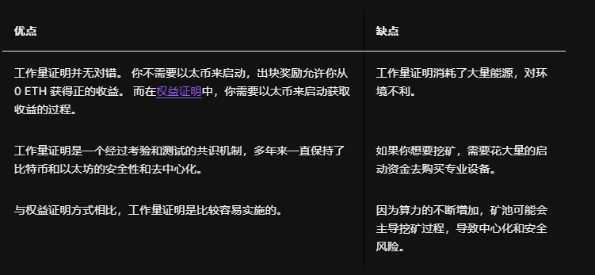

# 1. Reference
https://ethereum.org/zh/developers/docs/consensus-mechanisms/pow/

# 2. What
工作量证明 (PoW)

以太坊网络最初采用一种称为工作量证明 (PoW) 的共识机制。 这种机制允许以太坊网络的节点就以太坊区块链上记录的所有信息的状态达成共识，并防止某些产生经济影响的攻击。 然而，以太坊在 2022 年终结了工作量证明并开始采用权益证明。

**工作量证明现已弃用**。 以太坊不再使用工作量证明作为其部分共识机制。 它改用权益证明。 阅读有关权益证明和质押的更多信息。
前提条件
为了更好地理解此页面，建议提前阅读交易、区块和共识机制。

什么是工作量证明 (POW)
中本聪共识采用工作量证明，一度允许去中心化的以太坊网络对帐户余额和交易顺序等达成共识（即所有节点都同意）。 这种机制防止用户“重复支付”他们的货币，同时确保极难攻击或操作以太坊区块链。 这些安全特性现在由权益证明提供，后者采用称为 Gasper 的共识机制。

# 3. 工作量证明和挖矿
工作量证明是一种基础性算法，它为矿工在工作量证明区块链上进行的工作设置难度和规则。 挖矿就是“工作”本身。 挖矿是向区块链中添加有效区块。 这很重要，因为链的长度有助于网络跟随区块链的正确分叉。 “工作”完成得越多，链越长，区块编号就越大，就更能确定网络达到最新状态。

有关挖矿的更多信息

# 4. 以太坊的工作量证明机制如何运作？
以太坊交易处理到区块中。 在现已弃用的工作量证明以太坊中，每个区块包含：

区块的难度，例如：3,324,092,183,262,715
混合哈希（mixHash），例如：0x44bca881b07a6a09f83b130798072441705d9a665c5ac8bdf2f39a3cdf3bee29
nonce--例如：0xd3ee432b4fb3d26b
这些区块数据与工作量证明直接相关。

# 5. 工作量证明机制
工作量证明协议 Ethash 要求矿工经过激烈的试错竞赛，找到一个区块的随机数。 只有具备有效随机数的区块才能加入区块链中。

当矿工们争相创建区块时，他们会反复通过一个数学函数放置一个数据集，此数据集只能通过下载和运行整条区块链获得（矿工们都是这样做的）。 该数据集用来产生一个低于目标随机数的混合哈希，而此目标随机数由区块难度决定。 做到这些最好的方式是试错。

难度决定了哈希的目标值。 目标值越小，有效哈希的集合就越小。 一旦生成哈希，其他矿工和客户端就很容易验证哈希。 即使一条交易记录出现改变，整个哈希就会变得完全不同，表示出现欺诈。

哈希使得欺诈更容易被发现。 此外，工作量证明作为一个流程，同样有效威慑了对区块链的攻击。

# 6. 工作量证明和安全性
激励矿工在以太坊主链上挖矿。 对于一小部分矿工而言，没有任何激励措施让他们去开辟一条自己的新链 - 因为这破坏了体系。 区块链依赖于唯一状态来判断真实性。

工作量证明的目标是延长链。 最长的链是最可信的有效链，因为需要完成最多的计算工作来生成它。 在以太坊的工作量证明体系中，几乎不可能创建新的区块来清除交易、创建虚假交易或维护第二条链。 那是因为恶意矿工总是需要比其他人更快地解出区块随机数。

要持续创建恶意但有效的区块，恶意矿工将需要超过 51% 的网络挖矿算力才能击败其他人。 这种海量的“工作”需要大量昂贵的算力，而且消耗的能源甚至可能超过攻击所得的收益。

# 7. 工作量证明的经济模型
工作量证明还负责向系统中发行新货币并激励矿工完成工作。

自君士坦丁堡升级以来，成功创建区块的矿工将获得两个新铸造的以太币及部分交易费作为奖励。 叔块也会获得 1.75 个以太币的补偿。 叔块是由一个矿工创建的有效区块，几乎与此同时另一个矿工创建了规范区块。要确定规范区块，最终取决于哪条链构建于第一个区块之上。 叔块通常是由于网络延迟而出现。

# 8. 最终确定性
如果交易属于一个无法更改的区块时，它就在以太坊上具有“最终确定性”。

由于矿工以去中心化的方式工作，有可能同时开采出两个有效区块。 这就产生了一个临时分叉。 最后，在后续区块被开采出并添加到其中一条链使其更长时，这条链就会成为被接受的链。

但更复杂的是，在临时分叉上被拒绝的交易可能没有包含在被接受的主链上。 这意味着区块是可逆的。 因此，最终确定性是指你在认为交易不可逆之前需要等待的一段时间。 在以前的工作量证明以太坊中，一个特定区块 N 之后开采出的区块越多，就更加确信区块 N 内的交易是成功的且不可回滚。 现在，基于权益证明机制，最终确定是区块的明确属性，而不再是概率性的。

# 9. 工作量证明能源消耗
对工作量证明提出的一项主要批评是保证网络安全所需的能源消耗。 为了维持安全和去中心化，采用工作量证明的以太坊每年消耗大量能源。 在即将过渡到权益证明之际，以太坊矿工的总能源消耗大约为 70 亿千瓦时/年（大约与捷克共和国相当 - 数据来自 2022 年 7 月 18 日 digiconomist(opens in a new tab)）。

# 10. 优点和缺点

# 11. 与权益证明对比
从更高层面上看，权益证明和工作量证明的最终目标相同，即帮助去中心化网络安全地达成共识。 但它们在实现方式和人员上有些不同：

- 权益证明 (PoS) 让质押 ETH 不再需要算力。
- 权益证明 (PoS) 将矿工替换为验证者。 验证者通过质押他们的 ETH 来创建新的区块。
- 验证者不会竞争创建区块，而是由算法随机选择。
- 终局性是很清晰的：在特定的检查节点，如果 2/3 验证者确定了区块，这个区块将被视为最终状态。 验证者必须在区块压上自己全部质押，因此如果他们试图串通更改区块链，他们就会失去他们的全部质押。
  
有关权益证明的更多信息