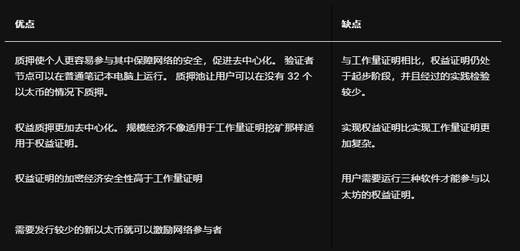

# 1. Reference
https://ethereum.org/zh/developers/docs/consensus-mechanisms/pos/

# 2. 什么是权益证明？
权益证明是一种证明验证者已经将有价值物品质押到网络上的方法。如果验证者有失信行为，这些物品可能会被销毁。 在以太坊的权益证明机制下，验证者明确地通过以太币将资产质押到以太坊上的智能合约中。 之后，验证者负责检查在网络上传播的新区块是否有效，偶尔自己也创建和传播新区块。 当他们试图欺骗网络（例如，在应该发送一个区块时提出多个区块，或者发送冲突的认证）时，他们质押的部分或全部以太币可能会被销毁。

# 3. 验证者
要想作为验证者参与，用户必须向存款合约中**存入 32 以太币并运行三种独立的软件：执行客户端、共识客户端和验证者客户端**。 存入以太币时，用户会进入一个激活队列，限制新验证者加入网络的速度。 激活后，验证者将从以太坊网络上的对等节点接收新区块。 
区块中的交易会被重新执行，以检查提议的以太坊状态变更是否有效，并检查区块的签名。 
**然后验证者在整个网络上发送支持该区块的投票（称为认证）。**

在工作量证明中，生成区块的时间是由挖矿难度决定的，而在权益证明中，节奏是固定的。 权益证明以太坊中的时间分为**时隙（12 秒）**和**时段（32 个时隙）**。 在**每个时隙中随机选择一位验证者作为区块提议者**。 该验证者负责**创建新区块并发送给网络上的其他节点**。 另外在每个时隙中，都会随机选择一个**验证者委员会**，通过他们的投票确定所提出区块的有效性。 将验证者集合划分为若干个委员会对于保持网络负荷易于管理非常重要。 委员会将验证者集合分成不同部分，以便每个活跃的验证者在每个时段都会出示证明，但并不在每个时隙都这样做。

# 4. 如何在以太坊权益证明中执行交易
下面提供了关于如何在以太坊权益证明中执行交易的全面解释。

**用户使用他们的私钥创建并签署交易**。 这通常由钱包或库处理，例如 ethers.js(opens in a new tab)、web3js(opens in a new tab)、web3py(opens in a new tab) 等，但**本质上是用户在使用以太坊 JSON-RPC 应用程序接口向节点发出请求**。 用户定义他们准备支付一定量的燃料作为给验证者的小费，以鼓励他们将交易纳入在一个区块中。 **小费支付给验证者，而基础费被销毁**。
**交易被提交给以太坊执行客户端验证有效性**。 这意味着**确保发送人有足够的以太币来完成交易，并且他们已经使用正确的密钥来签名交易。**

如果交易有效，执行客户端将其添加到其**本地内存池（待处理交易列表）**，并**通过执行层广播网络将其广播到其他节点**。 当其他节点听到关于交易的消息时，**它们也将其添加到本地内存池中**。 高级用户可能会避免广播他们的交易，而是将其转发给专门的区块构建器，例如 Flashbots Auction(opens in a new tab)。 这使他们能够在即将到来的区块中组织交易以获得最大利润（最大可提取价值）。
网络上的验证节点之一是当前时隙的区块提议者（之前已使用 RANDAO 以伪随机方式选择）。 该节点负责构建和广播下一个要添加到以太坊区块链的区块并更新全局状态。 **该节点由三部分组成：执行客户端、共识客户端和验证者客户端。**

**执行客户端将来自本地内存池的交易捆绑到“执行负载”中，并在本地执行它们以生成状态更改。 此信息被传递到共识客户端。**
**在该客户端，执行有效载荷被包装为“信标区块”的一部分。该信标区块还包含有关奖励、惩罚、罚没、认证等的信息，从而使网络能够就链头的区块顺序达成一致。** 连接共识客户端和执行客户端中更详细地描述了执行客户端和共识客户端之间的通信。

**其他节点在共识层广播网络上接收新的信标区块， 并将其传递给它们的执行客户端。在执行客户端上，交易在本地重新执行以确保提议的状态更改有效。 然后，验证者客户端证明该区块是有效的，并且根据他们对链的看法，这是逻辑上的下一个区块（这意味着它建立在具有最大认证权重的链上，如分叉选择规则所定义）。 该块被添加到证明它的每个节点的本地数据库中。**

如果一笔交易已经成为两个检查点之间具有“绝对多数链接”的链的一部分，那么可以认为该交易已经“最终确定”。 检查点发生在每个时段的开始，并且它们的存在是为了考虑到只有活跃验证者的子集在每个时隙中提供证明，但所有活跃验证者在每个时段内都会提供证明。 因此，只有在时段之间才能证明“超过半数链接”（这是指网络上总质押以太币的 66％ 同意两个检查点的情况）。
有关最终确定性的更多详细信息，请参见下文。

# 5. 最终确定性
交易在分布式网络中具有“最终确定性”是指，该交易是区块的一部分，而且除非销毁大量以太币，否则便无法改变。 在权益证明以太坊上，通过**检查点区块**来管理最终确定性。 **每个时段中的第一个区块是检查点**。 验证者为其认为有效的“检查点对”投票。 如果一对检查点获得了质押以太币总数中三分之二以上的投票，那么这对检查点将被升级。 这两个（目标）中较新的一个会变成“合理”状态。 较旧的一个检查点已经是合理状态，因为它是上一个时段中的“目标”。 现在，这个检查点会升级为“最终确定”状态。

要回滚最终确定的区块，攻击者将承担至少相当于质押以太币总数三分之一的损失。 这篇以太坊基金会博文(opens in a new tab)解释了其确切原因。 因为最终确定性需要获得三分之二多数投票，攻击者可以用质押以太币总数的三分之一投票来阻止网络实现最终确定性。 有一种可以防御这种攻击行为的机制：怠惰惩罚(opens in a new tab)。 当链超过四个时段无法最终确定时，这项机制会触发。 怠惰惩罚逐渐消耗与其投票与大多数投票相反的验证者的质押以太币，使得大多数验证者重新获得三分之二多数投票并最终确定链。

# 6. 加密经济的安全性
运行验证者是一种承诺。 验证者应当保持足够的硬件和连接，来参与区块的验证和提出。 作为回报，验证者将获得以太币（他们的质押余额增加）。 另一方面，作为验证者参与，也为用户为了个人利益或破坏而攻击网络开辟了新的渠道。 为了防止这种情况，如果验证者在被调用时未能参与，他们就会错过以太币奖励；如果他们有不诚实行为，他们现有的质押可能会被销毁。 **主要有两种行为被视为不诚实：在一个时隙中提出多个区块（模棱两可）和提交相互矛盾的认证。**

被罚没以太币的金额取决于大致同一时间受到罚没的验证者数量。 这称为“相关性惩罚”(opens in a new tab)，相关性惩罚可以是轻微的（单个验证者被罚没质押以太币的 1%），也可以是导致验证者质押的以太币全部被销毁（大额罚没事件）。 这种惩罚在强制退出期执行，首先是第 1 天的立即惩罚（最多 1 个以太币），接着是第 18 天的相关性惩罚，最后是第 36 天的逐出网络。 如果验证者在网络上但不提交投票，他们每天都会受到轻微的认证惩罚。 对于攻击者来说，这些措施都意味着协同攻击的代价将极其高昂。

# 7. 分叉选择
当网络以最佳状态诚信运行时，链头始终只会有一个新区块并且所有验证者都会证明它。 然而，由于网络延迟或因为区块提议者提出多个区块（模棱两可），验证者可能看到不同的链头视图。 因此，共识客户端需要一种算法来确定支持哪一个区块。 权益证明以太坊中使用的算法称为 [LMD-GHOST](https://arxiv.org/pdf/2003.03052.pdf)。它的**工作原理是确定其历史记录中具有最大证明权重的分叉**。

# 8. 权益证明和安全性
正如在工作量证明中一样，权益证明中仍然存在 51% 攻击(opens in a new tab)的威胁，但对于攻击者来说风险却更大。 攻击者需要获得 51% 的质押以太币。 然后他们可以通过自己的认证确保他们首选的分叉拥有最多累积认证。 共识客户端使用累积认证的“权重”确定正确的链，所以攻击者能够使他们的分叉成为规范区块。 然而与工作量证明相比，权益证明的优势在于，社区能够灵活地发动反击。 例如，诚实的验证者可以决定继续在非主流链上构建并忽略攻击者的分叉，同时鼓励应用程序、交易所和池也这样做。 他们还可以决定强行将攻击者从网络中移除并销毁攻击者质押的以太币。 这些都是对 51% 攻击的强有力的经济防御措施。

除了 51% 攻击，不良行为者也可能尝试其他形式的恶意活动，例如：

- 远程攻击（尽管确定性工具能抵消这种攻击向量）
- 近程“重组”（尽管提议者权重提升和认证期限可以缓解这种情况）
- 弹跳和平衡攻击（也能通过提议者权重提升来缓解，并且这些攻击无论如何都只在理想化的网络条件下得到证明）
- 雪崩攻击（通过只考虑最新信息的分叉选择算法规则来抵消）

总的来说，已经证实以太坊实施的权益证明在经济方面比工作量证明更安全。

# 9. 与工作量证明相比
以太坊原来使用的是工作量证明，但在 2022 年 9 月转换为使用权益证明。 权益证明相较于工作量证明有如下一些优点：

能效更高 – 无需在工作量证明计算中使用大量能源
门槛更低、硬件要求下降 – 无需购买高性能硬件以便获得创建新区块的机会
中心化风险降低 – 权益证明应该可以增加保护网络安全的节点
由于能源需求低，发行较少的以太币就可以激励大家参与
与工作量证明相比，对不当行为的经济处罚让 51% 攻击的代价变得更高。
如果 51% 攻击是为了攻破加密经济的防御，那么社区可以求助于诚实链的社交恢复。