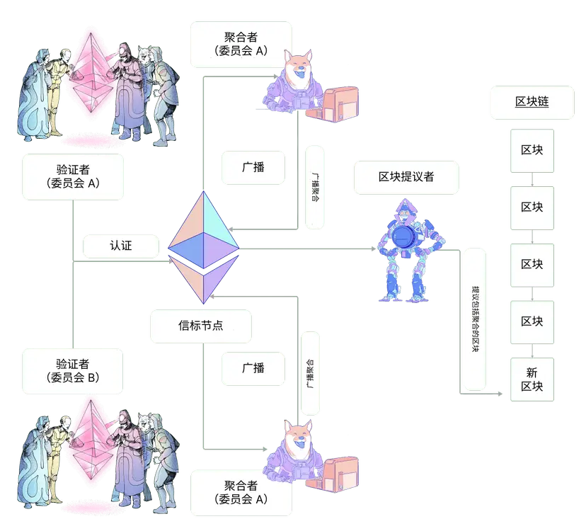

# 1. Reference
https://ethereum.org/zh/developers/docs/consensus-mechanisms/pos/attestations/

# 2. 什么是认证？
**每个时段（6.4 分钟）验证者都会向网络提议一个认证。** 
这个认证是针对时段中的一个特定时隙。 认证的目的是投票赞成验证者对于链的看法，特别是最近的合理区块和当前时段的第一个区块（被称为来源和目标检查点）。 所有参与的验证者的信息都会合并，使得网络可以达成关于区块链状态的共识。

认证包含以下组成部分：

- aggregation_bits：验证者的位列表，其位置映射到委员会中的验证者索引；(0/1) 数值表示验证者是否签名了数据（即，他们是否活跃和同意- 区块提议者）
- data：与认证相关的细节，如下方的定义
- signature：聚合了个人验证者签名的 BLS 签名

证明验证者的第一项任务是创建 data。 data 包含以下信息：

- slot：认证指向的时隙号
- index：一个数字，用来识别在给定的时隙中，验证者所属的委员会
- beacon_block_root：验证者在链头看到的区块的根哈希（应用分叉选择算法的结果）
- source：最终确定性投票的一部分，表示验证者认为的最新的合理区块
- target：最终确定性投票的一部分，表示验证者认为的当前时段的第一个区块

一旦 data 构造完成，验证者就可以将 aggregation_bits 中对应于他们自己的验证者索引的位从 0 翻转到 1，以表明他们已经参与。

最终，验证者签名认证并且在网络进行广播。

# 3. 聚合的认证
对于验证者来说，在网络传递此数据需要大量的开销。 因此，在更加广泛地广播前，个人验证者的认证会在子网内进行聚合。 这包括聚合签名，以便广播的认证包含共识 data 和一个签名，后者结合了所有同意 data 的验证者的签名。 
这可以使用 aggregation_bits 来检查，因为它提供了委员会中每个验证者的索引（其 ID 在 data 中提供），可用于查询个人签名。

**在每个时段，每个子网中会有 16 个验证者被选为聚合者**。 聚合者收集所有在广播网络听到的，与他们自己的 data 相同的所有认证。 每一个匹配认证的发送者被记录在 aggregation_bits 中。 然后聚合者将聚合的认证广播到更广泛的网络上。

当一个验证者被选为区块提议者时，他们打包从子网到新区块最新时隙的聚合认证。

# 4. 认证纳入生命周期
- 生成
- 传播
- 聚合
- 传播
- 纳入
- 
认证的生命周期在下面的示意图中概述：

# 5. 奖励
验证者提交认证将获得奖励。 认证奖励决于**参与标志（来源、目标和头)、基础奖励和参与率。**

每个参与标志都可以为真 (true) 或假 (false)，这取决于提交的认证及其纳入延迟。

最佳情况是全部三个标志都为真 (true)，此时对于每个正确标志，验证者将获得：

奖励 += 基础奖励 * 标志权重 * 标志认证率 / 64

标志认证率使用给定标志的所有认证验证者的有效余额之和与总活跃有效余额相比较得出。

# 6. 基础奖励
基础奖励根据证明验证者的数量及其有效质押以太币余额来计算：

base reward = validator effective balance x 2^6 / SQRT(Effective balance of all active validators)

# 7. 纳入延迟
在验证者对链头 (block n) 进行投票，并且 block n+1 还没有被提出的时候。 认证自然会在一个区块后被包含，因此，投票给 block n 称为链头的所有认证被包含在 block n+1 中，其纳入延迟为 1。 如果纳入延迟加倍到两个时隙，那么认证奖励将减半，因为认证奖励等于基础奖励乘以纳入延迟的倒数。

# 8. 认证场景
缺失投票验证者
验证者最多有 1 个时段来提交他们的认证。 如果在时段 0 缺失了认证，那就可以在时段 1 中提交并且附带纳入延迟。

# 9. 缺失聚合者
每个时段总共有 16 个聚合者。 此外，随机验证者订阅了两个子网的 256 个时段，在聚合者缺失的情况下作为备份。

缺失区块提议者
请注意，在某些情况下，幸运的聚合者可能也会成为区块提议者。 如果因为区块提议者缺失导致认证没有被包含，下一个区块提议者会捡起聚合的认证并将其包含到下一个区块中。 但是，纳入延迟将会增加 1。