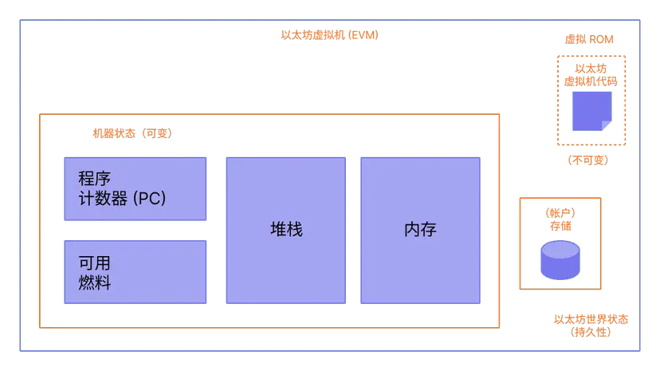
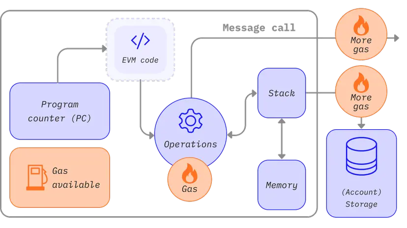

# 1. What

以太坊虚拟机 (EVM) 是一个去中心化虚拟环境，它在所有以太坊节点上一种安全一致地方式执行代码。 
节点运行以太坊虚拟机，以执行智能合约，利用“燃料”度量执行操作所需的计算工作，从而确保高效的资源分配和网络安全性。

虽然以太坊有自己的本机加密货币 (ETH)，遵循几乎完全相同的直观规则，但它也支持更强大的功能：智能合约。 对于此更复杂的功能，需要一个更复杂的类比。 以太坊不是分布式账本，而是分布式状态机器(opens in a new tab)。 以太坊的状态是一个大型数据结构，它不仅保存所有帐户和余额，而且还保存一个机器状态，它可以根据预定义的一组规则在不同的区块之间进行更改，并且可以执行任意的机器代码。 在区块中更改状态的具体规则由 EVM 定义。

EVM 作为一个堆栈机(opens in a new tab)运行，其栈的深度为 1024 个项。 每个项目都是 256 位字，为了便于使用，选择了 256 位加密技术（如 Keccak-256 哈希或 secp256k1 签名）。

在执行期间，EVM 会维护一个瞬态内存（作为字可寻址的字节数组），该内存不会在交易之间持久存在。

然而，合约确实包含一个 Merkle Patricia 存储 trie（作为可字寻址的字数组），该 trie 与帐户和部分全局状态关联。

已编译的智能合约字节码作为许多 EVM opcodes执行，它们执行标准的堆栈操作，例如 XOR、AND、ADD、SUB等。 EVM 还实现了一些区块链特定的堆栈操作，如 ADDRESS、BALANCE、BLOCKHASH 等。

# 2. 状态

## 2.1 What

在以太坊环境中，状态是一种称为改进版默克尔帕特里夏树的巨大数据结构，它保存所有通过哈希关联在一起的帐户并可回溯到存储在区块链上的单个根哈希。

## 2.2 以太坊状态转换函数

EVM 的行为就像一个数学函数：在给定输入的情况下，它会产生确定性的输出。 因此，将以太坊更正式地描述为具有状态转换函数非常有帮助：

Y(S, T)= S'

给定一个旧的有效状态 （S）> 和一组新的有效交易 （T），以太坊状态转换函数 Y（S，T） 产生新的有效输出状态 S'

# 3. How to implement EVM

EVM 的所有实现都必须遵守以太坊黄皮书中描述的规范。

在以太坊九年的历程中，以太坊虚拟机经过了几次修订，并且存在不同编程语言实现的以太坊虚拟机版本。

以太坊执行客户端都包含一个以太坊虚拟机实现。 此外，还有多个独立的实现，包括：

Py-EVM(opens in a new tab) - Python
evmone(opens in a new tab) - C++
ethereumjs-vm(opens in a new tab) - JavaScript
revm(opens in a new tab) - Rust
