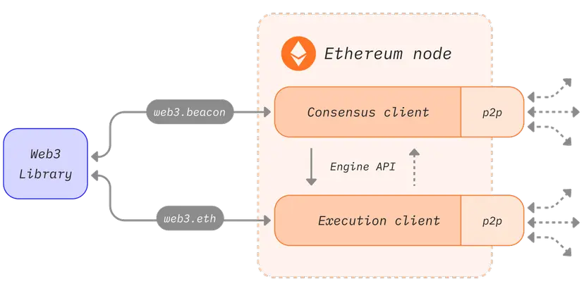
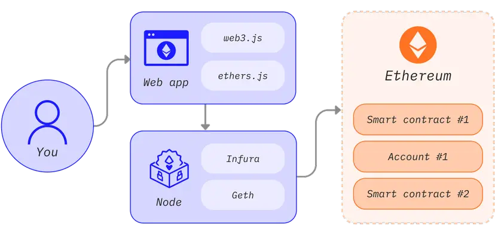

# 1. What

以太坊是一个由计算机组成的分布式网络，这些计算机运行**可验证区块和交易数据的软件**，称为**节点**。 

该软件必须在你的计算机上运行，才能将其转化为以太坊节点。 

**一个节点由两个独立的软件（名为“客户端”）构成。**

什么是节点和客户端？

“节点”是指任何以**太坊客户端软件的实例**，它连接到其他也运行以太坊软件的计算机，形成一个网络。 
客户端是以太坊的实现，它根据协议规则验证数据并保持网络安全。 

**一个节点需要运行两种客户端软件：共识客户端和执行客户端。**

- **共识客户端**（也称为信标节点、CL 客户端或旧称“以太坊 2”客户端）实现**权益证明共识算法**，使网络能够根据来自执行客户端的经验证数据达成一致。 此外还有名为 **验证者 的第三种软件**，它们可被添加到共识客户端中，使节点能参与保护网络安全。
这些客户端软件相互协作，以追踪以太坊的链头，并允许用户与以太坊网络进行交互。 
这种模块化设计称为封装复杂性，包含多个协同运作的软件。 
此方法让无缝实施合并变得更简单，客户端软件更易于维护和开发，并且还能重复利用各个客户端（例如在二层网络生态系统当中）。

- **执行客户端**（也称为执行引擎、EL 客户端或旧称“以太坊 1”客户端）**侦听网络中广播的新交易，并在以太坊虚拟机中执行它们，并保存所有当前以太坊数据的最新状态和数据库。**



关联执行与共识客户端的简化图。


# 2. 客户端多样性

不同团队开发的各种编程语言中都有执行客户端和共识客户端。

多种客户端实现减少了对于单一代码库的依赖，使网络更强大。 它的理想目标是实现多样性，即没有任何客户端在网络中占据主导地位，从而排除潜在的单点故障。 语言多样化有助于拓宽开发者社区，并允许他们用自己喜欢的语言创建集成。

这些实现的共同点是它们都遵循同一套规范。 这些规范规定了以太坊网络和区块链如何运作。 

此外，它们还定义了每项技术细节，你可以在以下内容中了解这些规范：

最初为以太坊黄皮书(opens in a new tab):https://ethereum.github.io/yellowpaper/paper.pdf
执行规范(opens in a new tab): https://github.com/ethereum/execution-specs/
共识规范(opens in a new tab): https://github.com/ethereum/consensus-specs
在各种网络升级中实现的以太坊改进提案(opens in a new tab):
    https://ethereum.org/zh/history/
    https://eips.ethereum.org/


# 3. 跟踪网络中的节点

多种跟踪器提供以太坊网络中节点的实时概览。 
请注意，由于去中心化网络的性质，这些爬虫只能提供有限的网络视图，并且可能会报告不同的结果。

节点地图(opens in a new tab)由 Etherscan 区块浏览器提供: https://etherscan.io/nodetracker
以太坊节点(opens in a new tab)由 Bitfly 提供: https://ethernodes.org/
Nodewatch(opens in a new tab) 由 Chainsafe 提供，爬取共识节点: https://www.nodewatch.io/
Monitoreth(opens in a new tab) — 由 MigaLabs 开发的分布式网络监测工具: https://monitoreth.io/


# 4. 节点类型
如果你想运行自己的节点，就应该明白节点有几种类型并且使用数据的方式亦不同。 
事实上，客户端可以运行**三种类型的节点：轻节点、全节点和归档节点**。 
其他一些不同的同步策略选项还能缩短同步时间。 
同步是指节点能以多快的速度获取最新的以太坊状态信息。

## 4.1 全节点
全节点对区块链进行逐块验证，包括下载和验证每个块的块体和状态数据。 

全节点分多种类别——有些全节点从创世区块开始，验证区块链整个历史中的每一个区块。 
另一些全节点则从更近期的区块开始验证，而且它们信任这些区块是有效的（如 Geth 的“快照同步”）。 

无论验证从哪里开始，**全节点只保留相对较新数据的本地副本（通常是最近的 128 个区块）**，允许删除比较旧的数据以节省磁盘空间。 旧数据可以在需要时重新生成。

- 存储全部区块链数据（会定期修剪，所以全节点并不存储包含创世块在内的所有状态数据）
- 参与区块验证，验证所有区块和状态。
- 全节点可以从本地储存中检索所有状态，或从“快照”中重新生成。
- 为网络提供服务，并应要求提供数据。

## 4.2 归档节点
归档节点是从创世块开始验证每个区块的全节点，它们从不删除任何下载的数据。

存储全节点中保存的所有内容，并建立历史状态存档。 
如果你想查询区块 #4,000,000 的帐户余额，或者想简单可靠地测试自己的一组交易而不使用跟踪挖掘它们，则需要归档节点。

这些数据以太字节为单位，这使得归档节点对普通用户的吸引力较低，**但对于区块浏览器、钱包供应商和链分析等服务来说则很方便。**

以归档以外的任何方式同步客户端将导致区块链数据被修剪。 
这意味着，不存在包含所有历史状态的归档，但全节点能够在需要时构建它们。

## 4.3 轻节点
轻节点只下载区块头，而不会下载每个区块。 这些区块头包含区块内容的摘要信息。 
轻节点会向全节点请求其所需的任何其他信息。 然后，轻节点可以根据区块头中的状态根独自验证收到的数据。
轻节点可以让用户加入以太坊网络，无需运行全节点所需的功能强大的硬件或高带宽。 
最终，轻节点也许能在手机和嵌入式设备中运行。 

**轻节点不参与共识（即它们不能成为矿工/验证者）**，但可以访问功能和安全保障和全节点相同的以太坊区块链。

轻客户端是以太坊积极发展的一个领域，我们预计很快就会看到共识层和执行层的新轻客户端。 
一些潜在的途径可在广播网络上提供轻客户端数据。 
这些途径的优点在于，广播网络可以支持轻节点网络而不需要全节点来处理请求。

以太坊目前还不支持大量轻节点，但轻节点支持是一个有望在不久的将来快速发展的领域。 
特别是像 Nimbus、Helios 以及 LodeStar 这样的客户端目前都非常关注轻节点。


# 5. 为什么应该运行以太坊节点？
运行节点可以让你直接以去信任方式私密地使用以太坊，同时通过保持网络更加稳健和去中心化来支持网络。

## 5.1 对你的好处
运行你自己的节点使你能够以私密、自给自足的去信任方式使用以太坊。 
你去信任网络，因为你可以使用自己的客户端验证数据。 “不要信任，直接验证”是一句在区块链领域非常流行的口头禅。

- 你的节点根据共识规则独自验证所有交易和区块。 这意味着你不必依赖网络中的任何其他节点或完全信任它们。

- 你可以将以太坊钱包与你自己的节点一起使用。 
    你可以更安全、更私密地使用去中心化应用程序，因为你不必将地址和余额泄露给中间商。 
    你可以用自己的客户端检查所有内容。 MetaMask(opens in a new tab)、Frame(opens in a new tab) 和许多其他钱包提供远程过程调用导入，这让它们可以使用你的节点。

- 你可以运行和自我托管其他依赖于以太坊数据的服务。 [MC]商业化可能性考量
    例如，可以是**信标链验证者、二层网络等软件、基础设施、区块浏览器、支付机构等。**

- 你可以**提供自己的自定义远程过程调用端点**。 [MC]商业化可能性考量
    你甚至可以公开地向社区提供这些端点，以帮助他们避免与大型中心化供应商合作。

- 你可以使用进程间通信 (IPC) 连接到节点，或者**重写节点将你的程序作为插件加载**[MC]商业化可能性考量
    这样可以减少网络延迟，例如在使用 web3 库处理大量数据时或者当你需要尽快替换交易时（即抢先交易）会带来很大帮助。
  
- 你可以直接质押以太币以保护网络并获得奖励。 请参见单独质押(参考我的其他md文档)以便开始操作。
  
如何通过你的应用和节点访问以太坊



## 5.2 对网络的好处
多样化的节点对于以太坊的健康、安全和运行弹性非常重要。

全节点强制执行共识规则，因此无法欺骗它们接受不遵循规则的区块。 
这在网络中提供了额外的安全性，因为如果所有节点都是轻节点，不进行完整验证，验证者可能会攻击网络。

如果遇到攻击并且攻破了权益证明加密经济防御，全节点可以执行社交恢复以选择跟随最诚实的链。

网络中的节点越多，网络就更加多样化和更加健壮，这是去中心化的最终目标，可实现一个抗审查的可靠系统。

全节点使依赖区块链数据的轻量级客户端能够访问这些数据。 

轻节点不存储整条区块链，而是通过区块头中的状态根验证数据。 
如果有需要，它们可以向全节点请求更多信息。
如果你运行一个全节点，整个以太坊网络都会从中受益，即使你没有运行验证者。


# 6. 运行你自己的节点
是否有兴趣运行你自己的以太坊客户端？

如需适合初学者的简介，请访问我们的运行节点页面以了解更多信息。https://ethereum.org/zh/run-a-node/

如果你是精通技术的用户，请深入了解有关如何启动你自己的节点的更多详细信息和选项。https://ethereum.org/zh/developers/docs/nodes-and-clients/run-a-node/

参考自己的其他文档.


# 7. 替代方法
设置自己的节点会耗费你的时间和资源，但你并非总是需要运行自己的实例。 在这种情况下，你可以使用第三方应用程序接口提供商。 有关使用这些服务的概述，请查看节点即服务。

如果有人在你的社区中运行带有公共应用程序接口的以太坊节点，你可以通过自定义的远程过程调用将你的钱包指向一个社区节点，并获得比一些随机的可信第三方更多的隐私保护。

另一方面，如果你运行一个客户端，可以与可能需要它的朋友共享。


# 8. 执行客户端
以太坊社区维护着多种开源的执行客户端（以前名为“以太坊 1 客户端”，或直接被称为“以太坊客户端”），它们由不同的团队使用不同的编程语言开发。 这使得网络更强大、更多样化。 它的理想目标是实现多样性，即没有任何客户端占据主导地位，从而减少任何单点故障。

下表汇总了不同的客户端。 这些客户端均通过客户端测试并得到积极维护，以保持与网络升级同步。

```
客户端	            语言	     操作系统：	              网络	                 同步策略	             状态缓冲
Geth	            Go	        Linux、Windows、macOS	主网、Sepolia、Holesky	快照、完全	            Archive、Pruned
Nethermind	        C#、.NET	Linux、Windows、macOS	主网、Sepolia、Holesky	快照（不提供服务）、快速、完全	Archive、Pruned
Besu	            Java	    Linux、Windows、macOS	主网、Sepolia、Holesky	快照、快速、完全	     Archive、Pruned
Erigon	            Go	        Linux、Windows、macOS	主网、Sepolia、Holesky	 完全	                Archive、Pruned
Reth	            Rust语言	Linux、Windows、macOS	主网、Sepolia、Holesky	 完全	                Archive、Pruned
EthereumJS（测试版） TypeScript	 Linux、Windows、macOS	Sepolia、Holesky	     完全	                修剪
```

有关受支持网络的更多信息，请仔细阅读以太坊网络。

每种客户端都有独特的用例和优势，所以你应该根据自己的偏好来选择。 
多样性使得实现能够侧重于不同的功能和用户群。 你可能想根据功能、支持、编程语言或许可证选择一种客户端。

## 8.1 Besu
Hyperledger Besu 是一种企业级以太坊客户端，面向公共网络和许可网络。
它运行所有以太坊主网功能（从追踪到 GraphQL），可进行大范围监控，并通过开放的社区渠道和企业级商用服务等级协议获得 ConsenSys 支持。 Besu 用 Java 语言编写，并依照 Apache 2.0 获得许可。

Besu 提供内容丰富的文档(opens in a new tab)，以指导你了解有关其功能和设置的所有详细信息。

## 8.2 Erigon
Erigon 以前称为 Turbo‐Geth，最初是 Go Ethereum 的一个分叉，注重速度和磁盘空间效率。 它是一种完全重新设计的以太坊实现，目前用 Go 语言编写，但以其他语言编写的实现也在开发中。 Erigon 的目标是成为更快、模块化程度更高和更优化的以太坊实现。 它可以在 3 天内使用大约 2TB 的磁盘空间执行完整的存档节点同步。

## 8.3 Go Ethereum
Go Ethereum（简称 Geth）是以太坊协议的原始实现之一。 目前，**它是使用最为广泛的客户端**，拥有最大的用户群，为用户和开发者提供各种工具。 Geth 用 Go 语言编写，**完全开源**，并依照 GNU LGPL v3 获得许可。

在相关文档(opens in a new tab)中了解有关 Geth 的更多信息。https://geth.ethereum.org/docs

## 8.4 Nethermind
Nethermind 是使用 C# .NET 技术栈创建的以太坊实现，依照 LGPL-3.0 获得许可，可在包括 ARM 在内的所有主要平台上运行。 它的优越性能体现在：
- 优化虚拟机
- 状态访问
- 联网和丰富的功能，如 Prometheus/Grafana 仪表板、seq 企业日志支持、JSON-RPC 跟踪和分析插件。
Nethermind 也有详细的相关文档(opens in a new tab)、强大的开发支持、在线社区，并为高级用户提供全天候支持。

## 8.5 Reth
Reth（Rust 以太坊的简称）是一个以太坊全节点实现，专注于用户友好、高度模块化、高速度和高效率。 Reth 一开始由 Paradigm 开发和推动，并依照 Apache 和 MIT 许可证授权。

Reth 已达到生产就绪，适用于质押或高正常运行时间服务之类的关键任务环境。 在需要大裕度高性能保证的使用案例中表现良好，例如远程过程调用、最大可提取价值、索引、模拟和对等网络活动。

查看 Reth Book(opens in a new tab) 或 Reth GitHub 仓库(opens in a new tab)了解更多信息。

## 8.6 开发中的客户端
以下客户端仍处于早期开发阶段，尚不建议用于生产。
EthereumJS
EthereumJS 执行客户端 (EthereumJS) 是用 TypeScript 编写的，由许多包组成，包括由区块、交易和默克尔帕特里夏树类表示的核心以太坊原语和核心客户端组件（包括以太坊虚拟机 (EVM) 的实现、区块链类和 DevP2P 网络堆栈）。

通过阅读其相关文档(opens in a new tab)了解更多信息


# 9. 共识客户端

有多种共识客户端（以前称为“以太坊 2 客户端”）支持共识升级。 
它们负责**所有共识相关的逻辑，包括分叉选择算法、处理认证与管理权益证明奖励及惩罚。**

```
客户端	        语言	     操作系统：	              网络
Lighthouse	    Rust	    Linux、Windows、macOS	信标链、Goerli、Pyrmont、Sepolia、Ropsten 等
Lodestar	    TypeScript	Linux、Windows、macOS	信标链、Goerli、Sepolia、Ropsten 等
Nimbus	        Nim	        Linux、Windows、macOS	信标链、Goerli、Sepolia、Ropsten 等
Prysm	        Go	        Linux、Windows、macOS	信标链、Gnosis、Goerli、Pyrmont、Sepolia、Ropsten 等
Teku	        Java	    Linux、Windows、macOS	信标链、Gnosis、Goerli、Sepolia、Ropsten 等
Grandine（测试版 Rust语言	 Linux、Windows、macOS	 信标链、Goerli、Sepolia 等
```

## 9.1 Lighthouse
Lighthouse 是一种共识客户端实现，它用 Rust 语言编写，并依照 Apache-2.0 获得许可。 它由 Sigma Prime 维护，自信标链创世以来一直保持稳定且可直接投入生产。 各类企业、质押池和个人都依赖它。 从台式电脑到复杂的自动化部署，Lighthouse 的目标是在各种环境中实现安全、高性能和互操作性。

你可以在 Lighthouse 手册(opens in a new tab)中找到相关文档。

## 9.2 Lodestar
Lodestar 是一种生产就绪型共识客户端实现，它用 Typescript 语言编写，并依照 LGPL-3.0 获得许可。 它由 ChainSafe Systems 维护，是面向单独质押人、开发者和研究人员的最新共识客户端。 Lodestar 由信标节点和验证者客户端组成，并由以太坊协议的 JavaScript 实现提供支持。 Lodestar 旨在通过轻客户端提高以太坊的可用性，为更多开发者扩展可访问性，并进一步提高生态系统多样性。

你可以在 Lodestar 网站(opens in a new tab)上了解更多信息。

## 9.3 Nimbus
Nimbus 是一种共识客户端实现，它用 Nim 语言编写，并依照 Apache-2.0 获得许可。 它是一种供单独质押人和质押池使用的生产就绪型客户端。 Nimbus 专为提高资源效率而设计，可同样轻松地在资源有限的设备和企业级基础设施上运行，并且不会影响稳定性或奖励性能。 更少的资源占用意味着客户端在网络处于压力下时具有更大的安全边际。

在 Nimbus 相关文档(opens in a new tab)中了解更多信息

## 9.4 Prysm
Prysm 是一种功能齐全的开源共识客户端，它用 Go 语言编写，并依照 GPL-3.0 获得许可。 它具有可选的 Web 应用程序用户界面，并将单独质押人和机构用户的用户体验、相关文档和可配置性放在首位。

访问 Prysm 相关文档(opens in a new tab)以了解更多信息。

## 9.5 Teku
Teku 是最早的信标链创世客户端之一。 除了常规目标（安全性、稳健性、稳定性、可用性、性能）外，Teku 还特别致力于恪守全部各类共识客户端标准。

Teku 提供了非常灵活的部署选项。 信标节点和验证者客户端可以作为单个进程一起运行，这对于单独质押人来说非常方便；或者在处理复杂的质押操作时，节点也可以各自运行。 此外，Teku 实现了与 Web3Signer(opens in a new tab) 的完全互操作性，用于为密钥安全性签名并提供罚没防范措施。

Teku 用 Java 语言编写，并依照 Apache 2.0 获得许可。 它由 ConsenSys 的 Protocols 团队开发，该团队还要对 Besu 和 Web3Signer 负责。 在 Teku 相关文档(opens in a new tab)中了解更多信息。

## 9.6 Grandine
Grandine 是一种依据 GPL-3.0 许可的共识客户端实现，使用 Rust 语言编写。 它由 Grandine 核心团队维护，快速、高效且轻量。 它适合各种类型的质押者，从运行低资源设备（如树莓派设备）的单独质押者，到运行数万个验证者的机构质押者。

你可以在 Grandine 手册(opens in a new tab)中找到相关文档


# 10. 同步模式
为了追踪和验证网络中的最新数据，以太坊客户端需要与最新网络状态同步。 

同步方法如下：**从对等节点下载数据，用加密方法验证其完整性，并构建一个本地区块链数据库。**

同步模式代表了这个过程的不同方法，并进行了不同的折衷。 
客户端在实现同步算法方面也各不相同。 有关实现的具体细节，请参考你所选客户端的官方文档。

## 10.1 执行层同步模式
执行层可以在不同的模式下运行，以适应不同的使用案例，从重新执行区块链的世界状态到只从可信检查点同步链的小费。

### 完全同步
完全同步会下载所有区块（包括区块头和区块体），并通过执行自创世块以来的每个区块，以增量方式重新生成区块链的状态。

通过验证每笔交易，最大限度地减少信任并实现最高安全性。
随着交易数量的增加，处理所有交易可能需要几天到几周时间。
存档节点会执行完全同步，以构建（并保留）每个区块中每笔事务所做的状态更改的完整历史记录。

### 快速同步
与完全同步一样，快速同步会下载所有区块（包括区块头、交易和收据）。 
不过，快速同步并不重新处理历史交易，而是依赖收据，直至到达最近的头部时，再切换到导入和处理区块，以提供一个完整的节点。

快速同步策略。
降低处理需求以减少带宽使用。

### 快照同步
快照同步同样是逐块验证链。 不同的是，快照同步不是从创世区块开始，而是从一个最近的已知为真实区块链一部分的受信任检查点开始。 
节点会定期保存检查点，同时删除早于某个时间的数据。 这些快照被用于在需要时重新生成状态数据，而不是永久储存它。

最快的同步策略，目前是以太坊主网的默认策略。
节省大量磁盘空间和网络带宽，同时不牺牲安全性。
关于快照同步的更多信息(opens in a new tab)。

### 轻量同步
轻客户端模式下载所有区块头和区块数据，并对其中一些进行随机验证。 仅从可信的检查点同步链的头部。

仅获取最新状态，同时依赖于对开发者和共识机制的信任。
客户端在几分钟内便可以使用当前网络状态。
注意：轻量同步暂不支持权益证明以太坊，新版本轻量同步应该很快就会发布！


## 10.2 共识层同步模式

- 乐观同步
乐观同步是一种合并后同步策略，专为选择加入和向后兼容而设计，允许执行节点通过已确立的方法进行同步。 执行引擎可以在不进行完全验证的情况下乐观地导入信标区块，找到最新区块头，然后使用上述方法开始同步链。 接着，在执行客户端更新之后，它将通知共识客户端信标链中交易的有效性。

- 检查点同步
检查点同步也称为“弱主观性同步”，在同步信标节点时可提供卓越的用户体验。 它基于弱主观性假设，因而能够从最近的弱主观性检查点而不是从创世块同步信标链。 检查点同步可大幅加快初始同步速度，其信任假设与从创世块同步时类似。

在实践中，这意味着你的节点会连接到远程服务，以下载最近的最终确定状态并从该点继续验证数据。 提供数据的第三方会受到信任，因此要谨慎选择。

