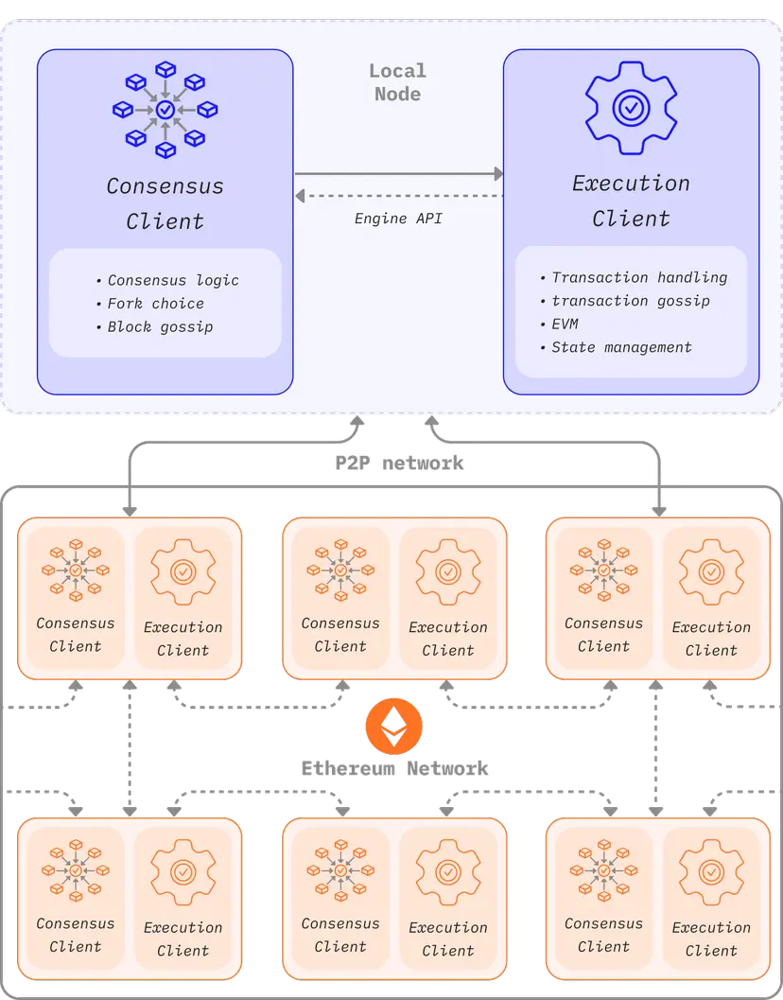
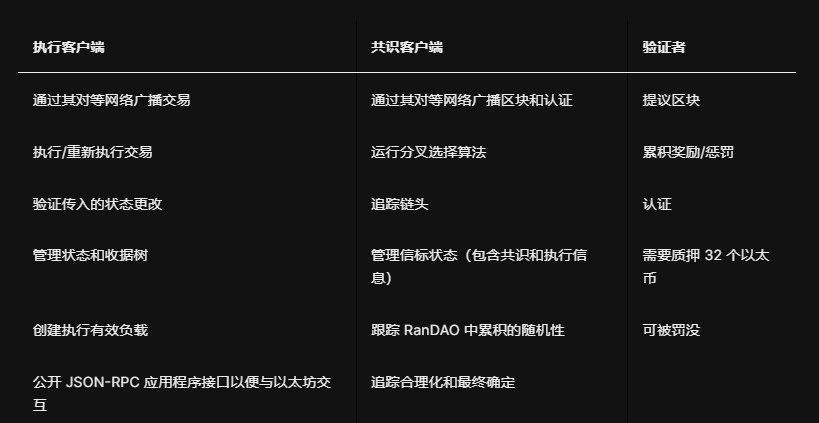

# 1.Reference
https://ethereum.org/zh/developers/docs/nodes-and-clients/node-architecture/

以太坊节点由执行客户端和共识客户端这两种客户端构成。

**当以太坊使用工作量证明时，执行客户端足以运行以太坊全节点。** 
**然而，在实施权益证明以后，执行客户端需要与另一种名为“共识客户端”的软件搭配使用。**

以下图表显示了两种以太坊客户端之间的关系。 这两种客户端与其各自的点对点（对等）网络连接。 
分离对等网络是有必要的，因为**执行客户端**通过它们的对等网络广播交易，确保它们**能够管理自己的本地交易池**，同时**共识客户端**通过它们的对等网络广播区块，**保证共识和链增长**。

要使这种双客户端结构发挥作用，共识客户端必须能够将大量交易传递给执行客户端。 在本地执行交易是客户端验证交易未违反任何以太坊规则的方式，并确保提议的以太坊状态更新是正确的。 同样，当节点被选为区块生产者时，共识客户端必须能够从 Geth 请求各种交易，以便将它们添加到新的区块，并通过执行它们来更新全局状态。 本地远程过程调用连接使用引擎应用程序接口(opens in a new tab)处理这种跨客户端通信。

# 2. 执行客户端的作用是什么？
执行客户端负责**交易处理、交易广播、状态管理和支持以太坊虚拟机（以太坊虚拟机）**。 
然而，**它不负责区块构建、区块广播或处理共识逻辑。 这些都是共识客户端的责任。**

执行客户端会创建执行有效负载——**交易列表、更新状态树和其他与执行相关的数据**。 共识客户端在每个区块中添加执行有效负载。 执行客户端还要在新的区块中重新执行交易，以确保其有效性。 
执行交易在执行客户端的嵌入式计算机中完成，这些计算机被称为以太坊虚拟机 (EVM)。

执行客户端还通过远程过程调用方法提供用户界面，让用户可以**查询以太坊区块链、提交交易和部署智能合约。**
远程过程调用通常由 [Web3js](https://docs.web3js.org/)、[Web3py](https://web3py.readthedocs.io/en/v5/)这样的库处理，或者由浏览器钱包等用户界面处理。

简而言之，执行客户端是：

- **以太坊的用户网关**
- **托管以太坊虚拟机、以太坊状态和交易池的地方**。

# 3. 共识客户端的作用是什么？
共识客户端处理**使节点与以太坊网络保持同步的全部逻辑**。 
这包括从对等节点接收区块并运行分叉选择算法，从而确保节点始终遵循累积证明最多的链（由验证者有效余额加权计算而得）。 

与执行客户端相似，共识客户端拥有自己的对等网络并通过该网络共享区块和认证。

**共识客户端不参与对区块的证明或提议——这是由验证者完成的**，而**验证者是共识客户端的一种可选附加组件**。 
没有验证者的共识客户端只会追踪链头，使节点保持同步。 
因此，用户可以使用其执行客户端与以太坊进行交易，并确信它们在正确的链上。

# 4. 验证者
节点运营商可以在存款合约中存入 32 个以太币来为其共识客户端添加一个验证者。 
验证者客户端与共识客户端捆绑在一起，并且可随时添加到节点中。 
验证者会**处理认证和区块提议。** 
它们使节点能够累积奖励或因为惩罚而丢失以太币。 
运行验证者软件还使节点有资格被选中来提议一个新区块。

# 5. 节点组件比较
