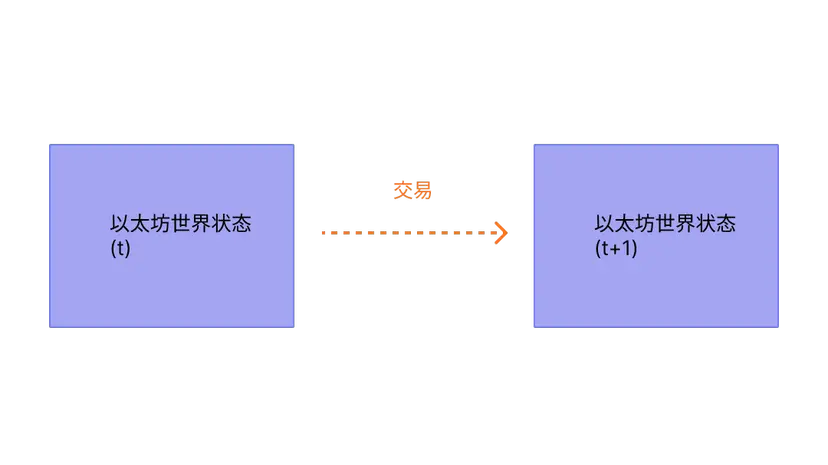
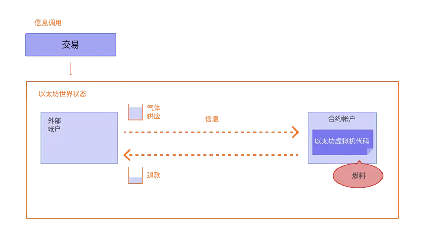

# 1. What

交易是由帐户发出，带密码学签名的指令。 

以太坊的“交易（Transaction）”是指 **被 EOA 直接发起，广播到网络，由矿工或验证者打包的结构**

核心特征：

- 必须有 签名（Signature），表明谁发起
- 消耗 gas
- 包含 nonce（防止重放）

只有 EOA 才拥有私钥、能签名，所以只有 EOA 能发起真正意义上的交易（Transaction）。

```
EOA 全称：Externally Owned Account
中文：外部拥有账户 / 外部账户

它是以太坊账户模型中的一种，由私钥控制，拥有地址，任何用户用钱包（比如 MetaMask、硬件钱包）创建的地址，本质上都是 EOA。
```

帐户将发起交易以更新以太坊网络的状态。 最简单的交易是将 ETH 从一个帐户转到另一个帐户。

以太坊交易是指由外部持有帐户发起的行动，换句话说，是指由人管理而不是智能合约管理的帐户。 

例如，如果 Bob 发送 Alice 1 ETH，则 Bob 的帐户必须减少 1 ETH，而 Alice 的帐户必须增加 1 ETH。 交易会造成状态的改变。



改变 EVM 状态的交易需要广播到整个网络。 任何**节点**都可以广播在以太坊虚拟机上执行交易的请求；此后，验证者将执行交易并将由此产生的状态变化传播到网络的其他部分。

交易需要付费并且必须包含在一个有效区块中。 为了使本概述更加简洁，我们将另行介绍燃料费和验证。

所提交的交易包括下列信息：

- from - 发送者的地址，该地址将签署交易。 这将是一个外部帐户，因为合约帐户无法发送交易.
  - 为什么说合约帐户无法发送交易? 智能合约时是支持转账之类的啊, 这也是交易吧?
  - 答案: 合约里 payable 函数或 address.transfer()，只是合约内部逻辑里执行了资金转移，
    本质上：
    是在某个 外部交易（EOA 发的） 驱动下运行的属于 message call, 合约本身,不能主动发起新的交易广播到链上.
    In short: 
    合约账户只能“被动”执行，永远无法主动“发起”真正的以太坊交易。它能转账，但无法签名和广播新的交易。
- to — 接收地址（如果是外部帐户，交易将传输值。 如果是合约帐户，交易将执行合约代码）
- signature – 发送者的标识符。 当发送者的私钥签署交易并确保发送者已授权此交易时，生成此签名。
- nonce - 一个有序递增的计数器，表示来自帐户的交易数量
- value – 发送者向接收者转移的以太币数量（面值为 WEI，1 个以太币 = 1e+18wei）
- input data – 可包括任意数据的可选字段
- gasLimit – 交易可以消耗的最大数量的燃料单位。 以太坊虚拟机指定每个计算步骤所需的燃料单位
- maxPriorityFeePerGas - 作为小费提供给验证者的已消耗燃料的最高价格
- maxFeePerGas - 愿意为交易支付的每单位燃料的最高费用（包括 baseFeePerGas 和 maxPriorityFeePerGas）
  
燃料是指验证者处理交易所需的计算。 用户必须为此计算支付费用。 gasLimit 和 maxPriorityFeePerGas 决定支付给验证者的最高交易费。 关于燃料的更多信息。

交易对象看起来像这样：

```
{
  from: "0xEA674fdDe714fd979de3EdF0F56AA9716B898ec8",
  to: "0xac03bb73b6a9e108530aff4df5077c2b3d481e5a",
  gasLimit: "21000",
  maxFeePerGas: "300"
  maxPriorityFeePerGas: "10"
  nonce: "0",
  value: "10000000000",
}

```
但交易对象需要使用发送者的私钥签名。 这证明交易只可能来自发送者，而不是欺诈。

Geth 这样的以太坊客户端将处理此签名过程。

示例 JSON-RPC 调用：

```
{
  "id": 2,
  "jsonrpc": "2.0",
  "method": "account_signTransaction",
  "params": [
    {
      "from": "0x1923f626bb8dc025849e00f99c25fe2b2f7fb0db",
      "gas": "0x55555",
      "maxFeePerGas": "0x1234",
      "maxPriorityFeePerGas": "0x1234",
      "input": "0xabcd",
      "nonce": "0x0",
      "to": "0x07a565b7ed7d7a678680a4c162885bedbb695fe0",
      "value": "0x1234"
    }
  ]
}

```
示例响应：

```
{
  "jsonrpc": "2.0",
  "id": 2,
  "result": {
    "raw": "0xf88380018203339407a565b7ed7d7a678680a4c162885bedbb695fe080a44401a6e4000000000000000000000000000000000000000000000000000000000000001226a0223a7c9bcf5531c99be5ea7082183816eb20cfe0bbc322e97cc5c7f71ab8b20ea02aadee6b34b45bb15bc42d9c09de4a6754e7000908da72d48cc7704971491663",
    "tx": {
      "nonce": "0x0",
      "maxFeePerGas": "0x1234",
      "maxPriorityFeePerGas": "0x1234",
      "gas": "0x55555",
      "to": "0x07a565b7ed7d7a678680a4c162885bedbb695fe0",
      "value": "0x1234",
      "input": "0xabcd",
      "v": "0x26",
      "r": "0x223a7c9bcf5531c99be5ea7082183816eb20cfe0bbc322e97cc5c7f71ab8b20e",
      "s": "0x2aadee6b34b45bb15bc42d9c09de4a6754e7000908da72d48cc7704971491663",
      "hash": "0xeba2df809e7a612a0a0d444ccfa5c839624bdc00dd29e3340d46df3870f8a30e"
    }
  }
}

```
raw 是采用递归长度前缀 (RLP) 编码形式的签名交易
tx 是已签名交易的 JSON 形式。


# 2. 交易类型

以太坊有几种不同类型的交易：

常规交易：从一个帐户到另一个帐户的交易。

合约部署交易：没有“to”地址的交易，数据字段用于合约代码。

执行合约：与已部署的智能合约进行交互的交易。 在这种情况下，“to”地址是智能合约地址。


# 3. 关于燃料

如上所述，执行交易需要耗费燃料。 简单的转账交易需要 21000 单位燃料。

因此，如果 Bob 要在 baseFeePerGas 为 190 Gwei 且 maxPriorityFeePerGas 为 10 Gwei 时给 Alice 发送一个以太币，
Bob 需要支付以下费用：

```
(190 + 10) * 21000 = 4,200,000 gwei
--或--
0.0042 ETH
Bob 的帐户将会扣除 1.0042 个以太币（1 个以太币给 Alice，0.0042 个以太币作为燃料费用）

Alice 的帐户将会增加 +1.0 ETH

基础费将会燃烧 -0.00399 ETH

验证者获得 0.000210 个以太币的小费

```

```
1️⃣ baseFeePerGas 是啥？
👉 基础手续费（Base Fee）

由以太坊协议自动计算出来的，是当前区块必须支付的最低每Gas费用
直接被销毁（burn）掉，不属于矿工或验证者收入
作用：防止区块拥堵，稳定 Gas 市场价格

2️⃣ maxPriorityFeePerGas 是啥？
👉 矿工小费 / 验证者奖励（Priority Fee / Tip）

你愿意给矿工/验证者的额外小费
直接进矿工/验证者钱包
作用：打包时优先选择你（你给得多，矿工更乐意打包）

3️⃣ 那 total fee（每Gas花多少钱）怎么算？
实际支付的 gasPrice = baseFeePerGas + maxPriorityFeePerGas

举例：
gasPrice = 190 Gwei + 10 Gwei = 200 Gwei

4️⃣ 那 21000 是啥？
👉 21000 是 标准转账（transfer ETH）交易的 gas 消耗量

这是以太坊规定的固定值
代表执行一笔「普通转账」交易，EVM 需要执行的最小计算量

发送ETH: 21000, 标准转账（无合约调用）

调用合约: 更多, 看具体合约逻辑复杂度不同

代币转账: 约5万+, 因为涉及ERC20合约调用

5️⃣ 计算总交易费（Gas Fee）
公式：

总费用（gwei） = (baseFeePerGas + maxPriorityFeePerGas) * gasUsed

带入：

总费用 = (190 + 10) * 21000
      = 200 * 21000
      = 4,200,000 gwei

换算成 ETH：

4,200,000 gwei = 0.0042 ETH

```


未使用燃料退还示意图


任何未用于交易的燃料都会退还给用户帐户。


# 4. 智能合约交互
任何涉及智能合约的交易都需要燃料。

智能合约还可以包含被称为 view或 pure 的函数，这不会改变合约的状态。 
像这样，从外部帐户调用这些函数不需要任何燃料。 
此场景的底层远程过程调用 (RPC) 为 eth_call。

不同于使用 eth_call 进行访问，view 或 pure 函数通常也在内部（即从合约自身或其他合约）调用并消耗燃料。


# 5. 交易生命周期
交易提交后，就会发生以下情况：

- 以加密方式生成的交易哈希： 0x97d99bc7729211111a21b12c933c949d4f31684f1d6954ff477d0477538ff017
- 然后，该交易被广播到网络，并添加到由所有其他待处理的网络交易组成的交易池中。
- 验证者必须选择你的交易并将它包含在一个区块中，以便验证交易并认为它“成功”。
- 随着时间的流逝，包含你的交易的区块将升级成“合理”状态，然后变成“最后确定”状态。 
  通过这些升级，可以进一步确定 你的交易已经成功并将无法更改。 区块一旦“最终确定”，只能通过耗费数十亿美元 的网络级攻击来更改。


# 6. Typed Transaction Envelope交易
以太坊最初有一种交易形式。 每笔交易都包含 Nonce、燃料价格、燃料限制、目的地地址、价值、数据、v、r 和 s。 这些字段为 RLP 编码，看起来像这样：

```
RLP([nonce, gasPrice, gasLimit, to, value, data, v, r, s])
```

以太坊经过演变，已经支持多种类型的交易，从而能够在不影响传统交易形式的情况下实现访问列表和 EIP-1559 等新功能。

EIP-2718是允许这种行为的。 交易解释如下：

TransactionType || TransactionPayload

其中，字段定义如下：

- TransactionType - 一个在 0 到 0x7f 之间的数字，总共为 128 种可能的交易类型。
- TransactionPayload - 由交易类型定义的任意字节数组。
- 
基于 TransactionType 值，交易可被分为以下几类：

- Type 0（传统）交易：自以太坊推出以来使用的原始交易格式。 它们不包含 EIP-1559 中的功能，例如动态燃料费计算或智能合约访问列表。 传统交易缺少以序列化形式表明其类型的特定前缀，在使用递归长度前缀编码 (RLP) 时以 0xf8 字节开头。 这些交易的 TransactionType 值为 0x0。

- Type 1 交易： 作为以太坊柏林升级的一部分在 EIP-2930 中引入，这些交易包含一个 accessList 参数。 该列表指定了交易预期访问的地址和存储密钥，有助于降低涉及智能合约的复杂交易的潜在燃料花费。 EIP-1559 的费用市场变化不包含在 Type 1 交易中。 Type 1 交易还包括一个 yParity 参数，它可以是 0x0 或 0x1，表示 secp256k1 签名的 y 值奇偶性。 它们以字节 0x01 开头进行标识，其交易类型 (TransactionType) 值为 0x1。

- Type 2 交易通常称为 EIP-1559 交易，是在以太坊伦敦升级的 EIP-1559中引入的。 它们已成为以太坊网络上的标准交易类型。 这些交易引入了一种新的费用市场机制，通过将交易费分为基础费用和优先费用来提高可预测性。 它们以字节 0x02 开头，并包括 maxPriorityFeePerGas 和 maxFeePerGas 的字段。 Type 2 交易因其灵活性和效率，现已成为默认选择，特别是在网络严重拥堵期间，由于它能够帮助用户提高管理交易费用的可预测性，因此特别受到青睐。 这些交易的 TransactionType 值为 0x2。
